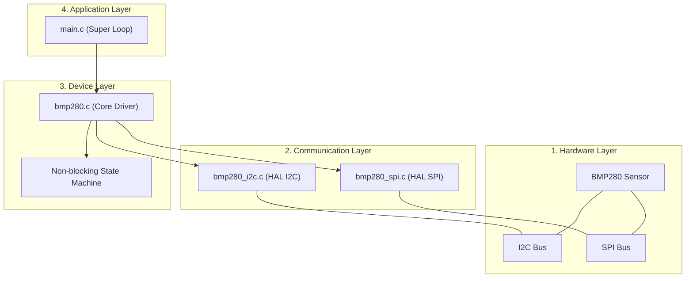

# BMP280 STM32 Bare-Metal Driver


## 1. Project Overview
This repository provides a highly optimized, non-blocking, bare-metal C driver for the Bosch BMP280 absolute barometric pressure and temperature sensor. It is designed specifically for STM32 microcontrollers utilizing the STM32CubeHAL framework. The objective of this project is to implement a robust, MISRA C compliant, and interrupt/DMA-driven sensor interface that seamlessly integrates into super-loop architectures without blocking the main CPU execution.

**Main Features:**
- **Non-blocking Architecture:** Utilizes Interrupts (IT) and Direct Memory Access (DMA) for fast data transfers without CPU stalling.
- **Protocol Agnostic:** Abstraction layer separating core business logic from hardware interfaces, supporting both I2C and SPI.
- **Hardware Agnostic API:** Easily portable to other STM32 families by simply swapping the hardware configuration parameters.

## 2. Production Architecture Overview



## 3. Layer Overview

### 1. Hardware Layer
Represents the physical BMP280 sensor and its connection to the STM32 microcontroller via either the I2C or SPI peripheral bus.

### 2. Communication Layer
Acts as the Hardware Abstraction Layer (HAL) wrapper (`bmp280_i2c.c` / `bmp280_spi.c`). This layer is responsible for executing the physical data transfers using STM32CubeHAL functions (Blocking, IT, or DMA). It translates standard read/write requests from the core driver into peripheral-specific operations.

### 3. Device Layer
Contains the core business logic (`bmp280.c`), register definitions, and mathematical compensation formulas required by the Bosch datasheet. This layer manages the sensor's internal state machine, parses raw ADC data, and calculates human-readable temperature and pressure values. It is completely isolated from direct hardware dependencies.

### 4. Application Layer
The user's super-loop task (`main.c`) that triggers sensor readings, checks the asynchronous reading states, and processes the final temperature and pressure data.

## 4. Hardware Configuration Guide

| Peripheral | Parameter | Required Configuration |
| :--- | :--- | :--- |
| **I2C** | Speed (SCL Frequency) | Standard Mode (100 kHz) or Fast Mode (400 kHz) |
| **I2C** | Device Address | `0x76` (SDO = GND) or `0x77` (SDO = VDD) |
| **I2C** | Pull-up Resistors | External 4.7kΩ - 10kΩ on SDA and SCL |
| **I2C DMA RX** | Stream / Channel | `DMA1_Stream2` / `Channel 7` |
| **I2C DMA RX** | Direction | `Peripheral to Memory` |
| **I2C DMA RX** | Priority | `Low` |
| **SPI** | Frame Format | Motorola |
| **SPI** | Data Size | 8 Bits |
| **SPI** | First Bit | MSB First |
| **SPI** | Clock Polarity (CPOL) | `High` (1) or `Low` (0) (Mode 0 or Mode 3 supported) |
| **SPI** | Clock Phase (CPHA) | `2 Edge` (1) or `1 Edge` (0) (Mode 0 or Mode 3 supported) |
| **SPI** | Chip Select (CS) | Software Managed (GPIO Output Push-Pull) |

## 5. Build Instructions

This project is generated using STM32CubeMX and built using CMake. 

```bash
# 1. Clone the repository
git clone <your_repository_url>
cd BPM_280

# 2. Generate the build system files
cmake --preset Debug

# 3. Compile the project
cmake --build --preset Debug
```

## 6. API Integration Example

Here is a minimal example of how to integrate the BMP280 driver using the I2C interface in your application:

```c
#include "bmp280.h"
#include "bmp280_i2c.h"

/* Define the interface structure globally */
BMP280_Interface bmp_device;
uint8_t i2c_address = 0x76; /* SDO tied to GND */
int32_t temperature;
uint32_t pressure;

int main(void) {
    /* Initialize HAL and Peripherals */
    HAL_Init();
    SystemClock_Config();
    MX_I2C2_Init();

    /* 1. Initialize the I2C porting layer */
    if (BMP280_I2C_Init(&bmp_device, &hi2c2, &i2c_address) != BMP280_OK) {
        Error_Handler();
    }

    /* 2. Configure the sensor (Standby time and Filter) */
    if (BMP280_Set_Config(&bmp_device, BMP280_STANDBY_250_MS, BMP280_FILTER_COEFF_16) != BMP280_OK) {
        Error_Handler();
    }

    /* 3. Configure Oversampling settings */
    if (BMP280_Set_Oversampling(&bmp_device, BMP280_OSRS_T_16X, BMP280_OSRS_P_16X) != BMP280_OK) {
        Error_Handler();
    }

    /* 4. Set sensor to Normal Mode 
     *
     * > [!IMPORTANT]
     * > Initialization order matters! Setting the sensor to Normal mode starts 
     * > the measurement cycles and locks certain configuration registers. 
     * > Therefore, setting the mode MUST always be the last step after all 
     * > other configurations (filters, oversampling, standby time) are applied.
     */
    if (BMP280_Set_Mode(&bmp_device, BMP280_MODE_NORMAL) != BMP280_OK) {
        Error_Handler();
    }

    uint32_t last_tick = 0;
    uint8_t current_reading_state = 0; /* 0: idle, 1: reading temp, 2: reading press */

    while (1) {
        if (current_reading_state == 0) {
            /* Wait for 1 second between readings */
            if (HAL_GetTick() - last_tick >= 1000) {
                current_reading_state = 1;
            }
        } 
        else if (current_reading_state == 1) {
            /* Poll temperature asynchronously */
            if (BMP280_Get_Temperature(&bmp_device, &temperature) == BMP280_OK) {
                current_reading_state = 2; /* Temperature ready, proceed to pressure */
            }
        } 
        else if (current_reading_state == 2) {
            /* Poll pressure asynchronously */
            if (BMP280_Get_Pressure(&bmp_device, &pressure) == BMP280_OK) {
                /* Both values are now ready! */
                /* temperature is in hundredths of a degree Celsius */
                /* pressure is in Pascals */

                /* Return to idle state for the next cycle */
                current_reading_state = 0;
                last_tick = HAL_GetTick();
            }
        }
        
        /* Other application tasks can run here without being blocked */
    }
}
```
